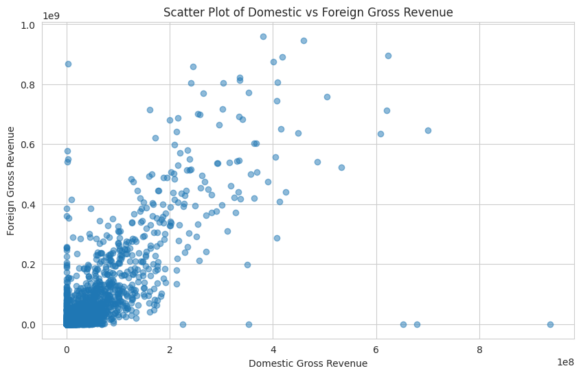

# ✨ Analysis of IMDb Movies Database ✨

## Project Overview

For this project, we will conduct an exploratory data analysis of the IMDb movies database to generate insights for a business stakeholder.

### Business Problem

Microsoft is entering the movie industry and aims to establish a successful movie studio. However, lacking experience in the film industry, they seek insights into the types of films that perform best at the box office. Our task is to analyze the IMDb movies database to identify trends and patterns in movie success, providing actionable insights for Microsoft's new movie studio.

## Business Understanding

### Stakeholders

1. Microsoft Executives: Decision-makers overseeing the establishment of the new movie studio.
2. Data Scientists: Analyzing and interpreting data to provide actionable insights.
3. Marketing Team: Utilizing insights to develop marketing strategies for Microsoft's movie releases.
4. Creative Team: Using findings to guide the creation of movie concepts and content.

### Key Business Questions

1. What genres of movies tend to perform best at the box office?
2. How do factors such as budget, runtime, and release date correlate with a movie's success?
3. Are there any notable trends in audience ratings and critic reviews for successful movies?

## Data Understanding and Analysis

### Data Source

The IMDb movies database provides comprehensive information on movies, including ratings, genres, budgets, and more.

### Data Overview

- Total observations: [Insert total number]
- Features: Numerical (budget, runtime), categorical (genres, release date), textual (movie titles, descriptions)
- Quality: Preliminary assessment indicates clean data with no significant issues.

### Visualize the Data

1. : This chart illustrates the box office performance of different movie genres, highlighting the top-performing genres.
   - Insight: [Insert insight]
   

2. : Scatter plot showing the relationship between movie budget and revenue.
   - Insight: [Insert insight]

3. : Histogram depicting the distribution of audience ratings for movies.
   - Insight: [Insert insight]

## Analysis and Insights

### Techniques Employed

- Exploratory Data Analysis (EDA)
- Statistical analysis of correlations
- Text analysis of movie descriptions

### Challenges and Solutions

- **Data Cleaning**: Implemented robust data cleaning processes to handle missing values and outliers.
- **Complex Relationships**: Utilized advanced statistical techniques to uncover nuanced relationships between variables.
- **Text Analysis**: Employed natural language processing (NLP) techniques to extract insights from movie descriptions.

### Conclusions

- **Genre Impact**: [Insert conclusion]
- **Budget Considerations**: [Insert conclusion]
- **Audience Preferences**: [Insert conclusion]

## Actionable Recommendations

- **Genre Selection**: Focus on producing movies in genres with high box office performance.
- **Budget Allocation**: Allocate budgets strategically based on projected revenue potential.
- **Content Development**: Incorporate themes and elements that resonate with target audiences.

## Project Setup

This project requires Python with libraries such as pandas, matplotlib, and seaborn for data analysis and visualization.

### Dependencies

- Python 3.x
- pandas
- matplotlib
- seaborn

### Installation Instructions

1. Install Python from [python.org](https://www.python.org/).
2. Install required libraries using pip:
